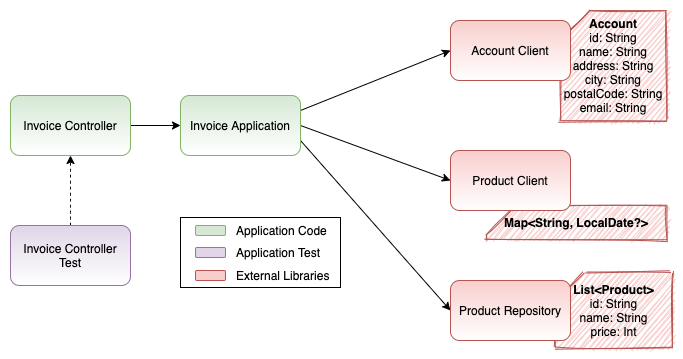

# Hexagonal Invoice Kata

The idea of this kata is to learn how to implement a hexagonal architecture project while understanding some benefits that it will bring to you and your team.

<sub>_Hexagon loading image property of [Ferenc Horvat](https://dribbble.com/ferenchorvat)_</sub>

## Table of Contents

- [Disclaimers](#disclaimers)
- [Why?](#why)
- [How?](#how)
- [Kata](#kata)
    * [1. Introduction](#1-introduction)
    * [2. Non-Hexagonal Solution](#2-non-hexagonal-solution)
    * [3. Migrating to Hexagonal Architecture](#3-migrating-to-hexagonal-architecture)
    * [4. Hexagonal Solution](#4-hexagonal-solution)
- [Summary](#summary)

## Disclaimers

This is a simple exercise to practice with hexagonal architecture. You can read multiple articles about hexagonal, and each one will give you a different view, different implementation details or different names. This is what worked for me in the lasts years. It does not mean that other solutions are worse or better, it's just my experience. Of course, following this architecture model, there are more advanced concepts, but the idea of this kata is to start with hexagonal, so it needs to be simple and demonstrate the basic concepts.

The same concepts can be applied to other languages or situations, but for sure, they will need to be adapted.

As said, this is an exercise just for the hexagonal architecture. Said that, do not expect that I enforce any other concept/behaviour during this kata. You can always do it following TDD, DDD, apply all the design principles that you want or do a code full of smells, if you understand how hexagonal architecture can be implemented, how to use it and when, that's the main objective of this kata.

You can always contact me, write an issue or directly create a PR if you want to propose, modify, update or correct anything in this project.

## Why?

There are multiple explanations, articles and even books out there about the pro/cons of hexagonal architecture that you can read to understand them, but as a summary, I would say:

- **Infrastructure independence**. It allows you to not be dependant on any infrastructure, call it a framework, database client, messaging system or any other concept you can imagine. It facilitates to modify for example a database by a REST endpoint, without modifying your business logic.
- **Business logic isolation**. Your business logic is the core of your application. You can develop the core concepts without being involved in I/O. It facilitates the incremental delivery strategy of your application, as lots of technology decisions can be replaced quickly if hexagonal architecture is implemented correctly in your project.
- **Easy to test**. It facilitates the unit testing of your application. There are multiple concepts out there about testing, but this architecture allows you to fully test your core concepts independently of your infrastructure, and vice-versa.
- **High Maintainability**. As your code is isolated, independent and easily testable, it facilitates the maintainability of your project. It allows you to introduce new features without too much effort, and refactor existing ones really quick.

## How?

### Rules

There are only two never-breaking rules in hexagonal architecture:

1. You need at least 3 layers of abstraction
2. You must always go from outer layers to inner layers, never the other side around.

### Components

More information to come :soon:


## Kata

You need Gradle and Kotlin for this kata. Some files needed by the kata are compiled with java 8, so you'll need also any JDK 8+

To compile the whole project, just execute 'gradle clean build' from terminal, or import the project with IntelliJ and let the magic happen! :sparkles:

### 1. Introduction

<ins>Description</ins>: Your new job starts today in a very famous media group :relaxed:. You have been told that you are hired to improve their current application that provides invoice data to their customers. The last intern created a simple application that accomplishes what they want nowadays, but you'll need to add new features to it quite soon, so it's better to start taking a look at it.

- Open the hexagonal-invoice-kata module and investigate it!
- Familiarize with the current code structure
- Check green tests :white_check_mark:



<ins>Summary</ins>: As you can see the current application has:

- `Application.kt` It's the application configuration, where all the Dependency Injection magic happens. It uses `ktor`
- `InvoiceController.kt` It's the controller that calls your current `InvoiceService` and returns a JSON response
- `InvoiceService.kt` It's where the business logic happens. Nowadays, it just calls all the `external-services` were we retrieve data, and created the `Invoice` object
- `external-services` dependency. There are 3 different dependencies, `AccountClient`, `ProductClient` and `ProductRepository`, where you are currently retrieving data from.

### 2. Non-Hexagonal Solution

**(15 - 30 min)**

If you are already convinced of the benefits of hexagonal architecture you can skip this part of the kata. Here we will familiarise ourselves more with our current application, and we will test our current architecture adding and modifying existing features/dependencies. The main idea is to check what happens in a non-organised architecture, and later on, compare the same changes with a hexagonal architecture

#### 2.1 Change the external dependency

<ins>Description</ins>: First thing we'll need to do before implementing any new logic, is update our company dependencies (`external-services`) to its latest version


- Change `externalServicesVersion` dependency version to `2` on file `hexagonal-invoice-kata-application/build.gradle.kts`
- Solve compilation issues on InvoiceService :warning:
- Check tests are red because of JSON changes :interrobang:
- Solve JSON changes
- Check green tests :white_check_mark:

<ins>Summary</ins>: You had to modify multiple parts of your `InvoiceService` due to changes in an external dependency. It also implied some changes to your JSON response :facepalm:

#### 2.2 New features to be implemented

<ins>Description</ins>: We want to add some discounts to some of our best customers. Premium accounts will have better prices. :money_with_wings:

- There is a new endpoint on `AccountClient` `getPremiumFeatures(accountId: String)`
- `ProductRepository` now returns also the `premiumPrice`
- Change `InvoiceService` to return premium prices for premium accounts
- Copy `kata-test-data/1-final` files to your `test/resources`. Overwrite everything
- Check green tests :white_check_mark:

<ins>Summary</ins>: You had some problems with the product price because you were using an external `Product` object.

#### 2.3 Another External Services version

<ins>Description</ins>: You have been told that the ProductRepository has been decommissioned, so you'll need to update to a newer version of `external-services`


- Change `externalServicesVersion` dependency version to `3` on file `hexagonal-invoice-kata-application/build.gradle.kts`
- This new version removes the need for a repository :heavy_exclamation_mark:
- Solve compilation issues on `InvoiceService` :warning:
- You'll need also to remove `ProductRepository` from `Application.kt` :warning:
- Solve JSON problems with fields we don't want to expose (PII data) :interrobang:
- Check green tests :white_check_mark:

<ins>Summary</ins>: You had to modify completely your `InvoiceService`, while there are no new business rules :facepalm:. You also exposed PII information from your customers :x:  but thanks to a test you realised before deploying in production.

#### 2.4 Summary

- Just one business rule change, but you modified your InvoiceService in all 3 steps :facepalm:
- Changes on external dependencies implied changes/issues across your whole application :anguished:
- Thanks to our existing tests, we realised that we were exposing critical PII information just updating an external dependency :triumph:
- If you added any test, that they were broken on each change :rage:

### 3. Migrating to Hexagonal Architecture

**(10 - 20 min)**

**TODO**

#### 3.1. Create the contracts

<ins>Description</ins>: We need to create the model and the contracts we want to offer (_outbound_) and the ones to retrieve the data we need (_inbound_)

- Rever or stash your change from the previous exercise. Leave the code as just cloned from GitHub
- Create model/outbound and model/inbound folders
- Create `InvoiceApi` interface on the outbound package, and offer a function to get an invoice from an accountId
- Create the `Invoice` model with all the fields (account, products, totalAmount)
- Now let's create inbound APIs. `AccountApi` and `ProductApi`
- Create the functions you think are needed in each API (think about the function from the business logic needs)
- Create also the respective models (`Account`, `Product`)

<ins>Summary</ins>: What functions did you create in ProductApi? If you think about it from the business logic needs, you just need a function to retrieve all the products from an accountId. If that product is retrieved from a client, a repository or from multiple different places is not something our business logic should care about at all.

There are multiple approaches to the models used in your APIs. You can always reuse the Account and Product models from the inbound package in your Invoice outbound model but can cause some issues in the future. I would always recommend to **use different models for both outbound and inbound packages**, even if they look the same.

#### 3.2 Implement our business logic

<ins>Description</ins>: Now that we have our outbound and inbound APIs, we can create our business logic.

- Create an `InvoiceService` in the domain package, and remove the existing `InvoiceApplication`
- Make it implement our outbound API, `InvoiceApi`
- It should also receive as parameters our inbound APIs, `AccountApi` and `ProductApi`
- Implement the business logic, retrieving data from inbound APIs and accomplishing the outbound API

<ins>Summary</ins>: Now you have all your business logic and related tests (because you've done tests, right?) done without any external dependency. It just depends on the APIs you created previously, your contracts.

#### 3.3 Implement our adapters

<ins>Description</ins>: We can create now our adapters, both outbound and inbound

- Update the current `InvoiceController` (our outbound adapter) to receive `InvoiceApi` as a parameter (the API, not the Service)
- Modify the code to call our API
- Create an `AccountAdapter` in the infrastructure layer package
- It should implement the `AccountApi` interface, and receive as a parameter the external `AccountClient`.
- Implement it!
- Create a `ProductAdapter` in the same package
- It should implement the `ProductApi` interface, and receive both `ProductClient` and `ProductRepository`.
- Implement the logic, doing both calls and aggregating results in the `Product` model

<ins>Summary</ins>: **TODO**

#### 3.4 Put it all together with Dependency Injection

<ins>Description</ins>: Now we need to inject our adapters instead of simple interfaces

- Update `Application.kt` to create an InvoiceService
- It should receive AccountAdapter and ProductAdapter in AccountApi and ProductApi places.
- Inject InvoiceService in our InvoiceController
- Execute tests and check all green

<ins>Summary</ins>: If you are not familiar with Koin or any other DependencyInjection framework, I'll give you the solution below:

```kotlin
install(Koin) {
    modules(module {
        single { AccountClient(configuration = AccountClientConfiguration()) }
        single { ProductClient(configuration = ProductClientConfiguration()) }
        single { ProductRepository(configuration = ProductRepositoryConfiguration()) }

        single {
            InvoiceService(
                accountApi = AccountAdapter(accountClient = get()),
                productApi = ProductAdapter(productClient = get(), productRepository = get())
            )
        }
        single { InvoiceController(invoiceApi = get<InvoiceService>()) }
    })
}
```

#### 3.5 Summary

In our application, we have now 3 different packages:

- **domain**: In this package, we just have business logic, no I/O operation, no external dependencies. You can have all your business tests isolated from any dependency, with no external noises.
- **infrastructure**: It contains all the adapters, inbound or outbound, that will plug into our ports, our APIs. All the external dependencies are treated here
- **model**: All our contracts, APIs and model, that our consumers/adapters will call/implement. There is no real code here, just APIs and models, the contract of **what** (and not how) our service does

### 4. Hexagonal Solution

**(10 - 20 min)**

Let's start with the exercise in this new hexagonal architecture fashion

#### 4.1. Change the external dependency

<ins>Description</ins>: First thing we'll need to do before implementing any new logic, is update our company dependencies (`external-services`) to their latest version

- Change `externalServicesVersion` dependency version to `2` on file `hexagonal-invoice-kata-application/build.gradle.kts`
- Now the compilation problems are just in ProductAdapter. Solve them!
- Check green tests :white_check_mark:

<ins>Summary</ins>: Your external dependencies have been modified, so you need to amend your adapter, that's all. Nothing more is broken. :muscle:

#### 4.2 New features to be implemented

<ins>Description</ins>: We want to add some discounts to some of our best customers. Premium accounts will have better prices. :money_with_wings:

- There is a new endpoint on `AccountClient` `getPremiumFeatures(accountId: String)`
- `ProductRepository` now returns also the `premiumPrice`
- Change `Account` model to return also `val premium: Boolean` and amend `AccountAdapter`
- Change `Product` model to include `premiumPrice` and amend `ProductAdapter` to return it
- Change `InvoiceService` to calculate premium prices for premium accounts
- Copy `kata-test-data/1-final` files to your `test/resources`. Overwrite everything
- Check green tests :white_check_mark:

<ins>Summary</ins>: You had to implement the new logic, so all these changes were needed

#### 4.3 Another External Services version

<ins>Description</ins>: You have been told that the ProductRepository has been decommissioned, so you'll need to update to a newer version of `external-services`

- Change `externalServicesVersion` dependency version to `3` on file `hexagonal-invoice-kata-application/build.gradle.kts`
- This new version removes the need for a repository :heavy_exclamation_mark:
- You just need to amend `ProductAdapter`, remove the repository and adapt your code
- You'll need also to remove `ProductRepository` from `Application.kt` :warning:
- Check green tests :white_check_mark:

<ins>Summary</ins>: You had no problems with PII data, and you didn't modify your business logic because of the repository being removed :punch:

#### 4.4 Summary

- Just one business rule change, so only one business logic change :clap:
- Changes on external dependencies implied changes just in the adapters :v:
- If you added any test, they all were not broken, just the ones modified :raised_hands:

## Summary

If you want to see my solution proposal, just look at `hexagonal-invoice-kata-solution` folder. If you uncomment '// "hexagonal-invoice-kata-solution",' on `settings.gradle.kts` file, you'll be able to compile and execute it!

More information to come :soon: